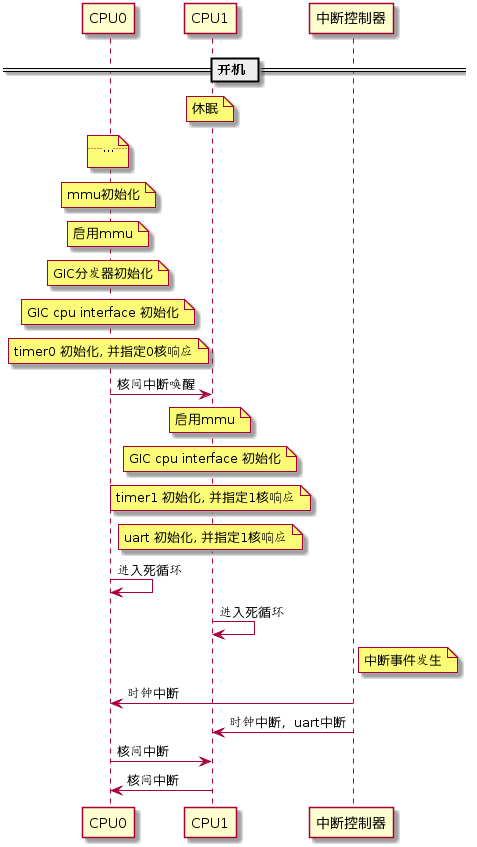

# RT-Thread 多核支持预备工作

## 1 目的和需求

    以下的内容列举了为进行RT-Thread多核开发和将来的移植工作而需要了解的相关硬件平台相关知识。

     RT-Thread团队的多核支持计划为首先以双核形式实现在qemu-vexpress-a9平台的上运行，所以作为预备工作，应先完成qemu-vexpress-A9平台的相应验证。

    以下包含了但并不限于arm平台的验证内容，在需要细节说明时，会以arm平台为例加以说明。

## 2  验证内容

    这些内容是以后移植时各个新平台需要实现的基本接口部分，涉及到的部分如下所列：

##### 1  非主核的核心是如何启动的，包括如何初始唤醒及指定其运行地址两个问题

    这部分需要验证非主cpu在系统上电后所处的状态，以及可确认的唤醒操作及其后跳转到指定运行地址的一系列过程。

    在不同的框架及平台上这部分的内容验证可能差别较大。

   在qemu-vexpress-A9平台上的验证内容为: 

   系统启动代码判断是否是主cpu，如果不是，跳转去特定地址打印出相关信息，观察是否有此类信息出现。

   *（A9平台上无此类信息出现，说明非主cpu此时未启动）*

   指定非主cpu运行地址及执行唤醒代码后，非主cpu是否按预想被唤醒及跳转去指定地址运行，它的运行流程中有相应的串口输出信息，观察此输出信息是否出现。

​      *(A9平台验证OK, 观察到输出信息出现，说明非主cpu已经按预期执行到指定地址)*    

##### 2  多个核心在启动之后独立运行

    以各自无限循环打印不同的信息来验证。

   在qemu-vexpress-A9平台上的验证内容为: 

    观察是否各自的打印信息都能无限正常输出。

​    *(A9平台验证OK, 观察到属于不同cpu的输出信息无限出输出）*

##### 3   spin_lock的实现及验证

    此部分内容可能和mmu相关（在armv7-a系统上是这样)  

    在qemu-vexpress-A9平台上的验证内容为: 

    主cpu初始化mmu表并以此启用mmu，非主cpu直接使用此mmu启用mmu，在第上节的无限循环中加入对同一个全局变量的读、运算、更新，打印内容操作，应该能看到由于非原子性操作造成的数据破坏情况发生。

​     *(A9平台验证OK, 观察到有错误数据情况出现）*

    实现spin_lock相关函数，并加入到操作此变量的过程中，看是否能由于锁的加入，变量的值可以得到正确的更新。

​     *(A9平台验证OK, 加入spin_lock后数据已经正常更新）*

##### 4   中断控制器的初始化设置，要对多核的中断分发进行验证。

    不同的系统的中断控制器有很大的不同。

​     在qemu-vexpress-A9平台上的中断控制器为arm的gicv2, 在此平台的验证内容为: 

     主cpu初始化GIC的分发器部分，分发器决定了每个中断源的目标cpu，中断优先级，中断分发是否允许等功能。

     每个cpu各自初始化各自的gic cpu interface部分，这是每个cpu都有的器件，用于通知和响应中断。

​     启用系统中的两个定时器，它们会产生不同的中断，并把这两个中断指定到不同的cpu去响应。观察中断能否在不同的cpu上正常响应。

​     *(A9平台验证OK, 可以看到发生在不同cpu上的中断输出)*

    同时为了RT-Thread的正常运行，串口的输入中断也是需要的，可测试把它指定到不同cpu去响应，并观察串口中断是否正常发生了。

​    *(A9平台验证OK，指定到任一cpu，输入中断都能正常响应)*

##### 5 测试多核间的通讯机制验证

   这里是验证通过相关体系及平台的相应通知方式，来达到多cpu间同步的目的。

  在qemu-vexpress-A9平台上的验证内容为:   

   在前述的循环中，以核间中断的方式去通知另一个cpu, 对方cpu在收到中断后会有相应操作和输出信息，观察相应操作和输出信息是否如期到达。

*(A9平台验证OK，在目标cpu收到核间中断后的操作及输出正常进行)*

## 3 qemu-vexpress-A9平台的验证时序图

## 