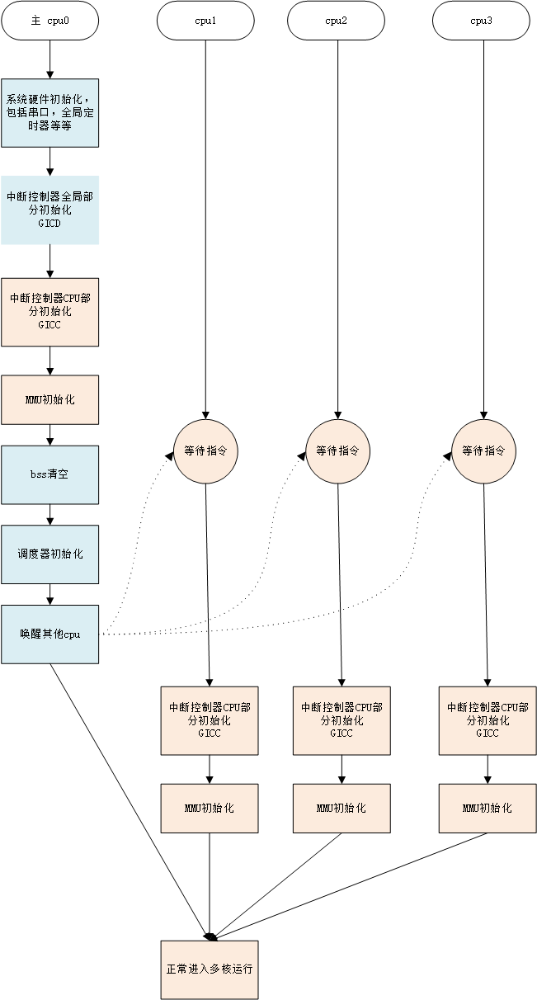
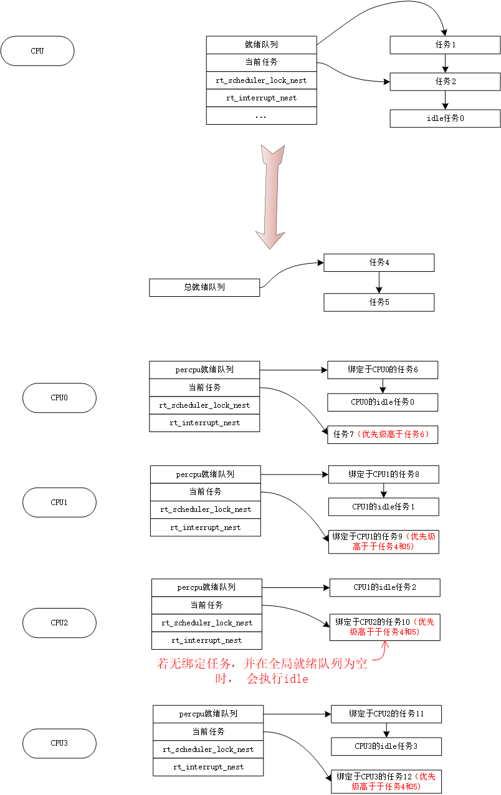
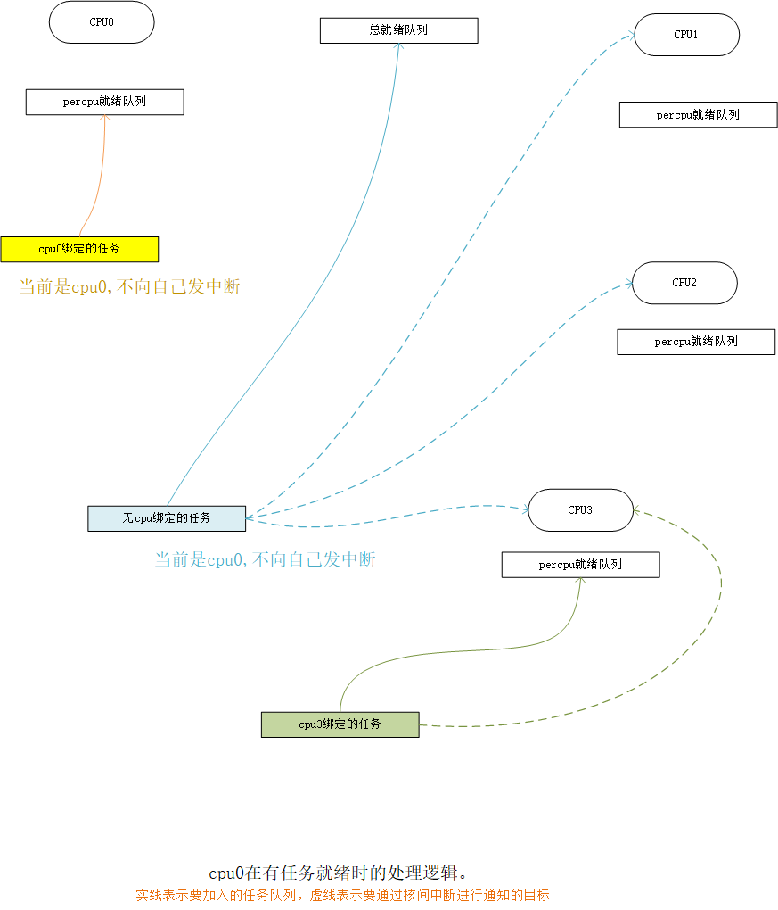
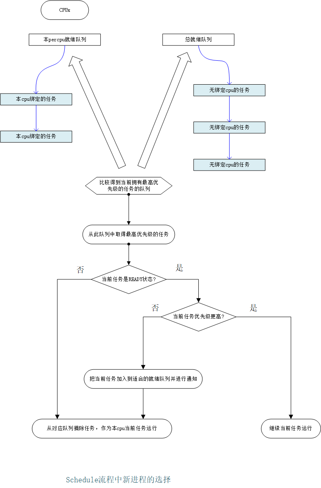

# RT-Thread SMP 支持方案

## 1 目标

第一步目标为让RT-Thread在SMP上正常运行，并支持任务核绑定功能(某任务限定运行在特定核上)。

宗旨为:

* 对现有系统的改动尽量小，性能问题留待以后优化。
* 做好结构上的设计，以适应将来的优化修改。
* 对application的部分，尽量做到不改动。

## 2 总览

目前下面的部分只是粗略列出，具体方案有待细化。

### 2.1 多核启动

1. 由主核(0)完成整个系统的初始化工作。
2. 其他的核在主核未初始化好时处于循环等待或进入低功耗状态，等待主核的启动指示。
3. 主核在安排好其它核的执行路径后，指示它们启动。
4. 非主核的启动流程中，只需初始化各自相关的部分，比如设置MMU、中断向量表，中断控制器的cpu_interface部分，核属定时器等，就可以开始进入到调度执行阶段。



### 2.2 多核间的同步和互斥

1. 多核间的通讯使用核间中断，互斥使用自旋锁。
2. 核间中断的发送和响应，以及自旋锁的实现，是体系相关的。

需求和API定义:

```C
    /* 互斥相关部分 */

    /* 自旋锁锁定 */
    void rt_spin_lock(rt_spinlock_t *lock);
    /* 自旋锁解锁 */
    void rt_spin_unlock(rt_spinlock_t *lock);

    /* 自旋锁锁定，同时禁止本地中断，返回之前的中断允许状态 */
    unsigned long rt_spin_lock_irq(rt_spinlock_t *lock);
    /* 自旋锁解锁，同时用之前的保存的返回值恢复中断允许状态 */
    void rt_spin_unlock_irq(rt_spinlock_t *lock, unsigned long flag);

    /* 本地中断禁止 */
    rt_base_t rt_hw_interrupt_disable();
    /* 本地中断允许 */
    void rt_hw_interrupt_enable(rt_base_t level);

    /* 核间中断相关部分 */

    /* 向所有核心发送核间中断 */
    void rt_ipi_broadcast(void);

    /* 向除了自己外所有核心发送核间中断 */
    void rt_ipi_broadcast_butself(void);

    /* 向由参数指定的所有核心发送核间中断 */
    void rt_ipi_send(const struct rt_cpumask *mask);

    /* 向特定核心发送核间中断 */
    void rt_send_ipi_to(unsigned long cpu);
```

参考：

linux中armv7构架中的最内层spin_lock相关是这样实现的：

```C
static inline void __raw_spin_lock(raw_spinlock_t *lock)
{
    unsigned long tmp;

    __asm__ __volatile__(
"1: ldrex   %0, [%1]\n"
"   teq %0, #0\n"
"   strexeq %0, %2, [%1]\n"
"   teqeq   %0, #0\n"
"   bne 1b"
    : "=&r" (tmp)
    : "r" (&lock->lock), "r" (1)
    : "cc");

    smp_mb();
}

static inline void __raw_spin_unlock(raw_spinlock_t *lock)
{
    smp_mb();

    __asm__ __volatile__(
"   str %1, [%0]\n"
    :
    : "r" (&lock->lock), "r" (0)
    : "cc");
}

```

### 2.3 每cpu变量的加入

系统支持多核之后，原本的全局变量会分成两类:

1. 第一类仍是全局变量，这部分变量的访问会使用自旋锁去进行加锁。
2. 第二类改成每cpu变量，这部分变量每个cpu都会有一份，只会由对应的cpu去访问，对它们的访问不用加锁，只需要做好重入防护(比如每个核上的当前任务结构指针)。

**注意:**

一些表示每个cpu相关信息的变量，和每cpu变量有点类似，但它是可以由其它cpu来访问的，所以也要进行加锁处理。典型的例子是：表示每个cpu的绑定任务的队列，在创建和修改任务核绑定时，可以由别的核访问)。



### 2.4 中断处理

和linux类似，设计为由主核来处理系统硬件中断(SPI)，而每个核处理各自的核属时钟中断(用于系统tick)和响应核间中断(PPI和SGI)。

**评估：是否会对实时性造成影响**

### 2.5 任务调度

原有RT-Thread中存在一个包含了所有就绪任务的就绪队列。

修改的设计是:

保留这个就绪队列的全局性，并为每一个核加入一个对应的就绪队列(例如：如果有4核，那在系统中存在有5个就绪队列)。

全局就绪队列中不包含有核绑定的任务，(即：有核绑定的任务就绪，不会加入到全局队列中)。

与核对应的队列中包含了在相关核上绑定的就绪任务(即：核绑定的任务就绪，只会加入到相应核的就绪队列中)。

相关操作:

1. 当某个任务转成就绪态时，会根据其是否有绑定而选择加入到正确的队列。
2. 当前核会向其它核发起核间中断，以通知其他核心任务就绪情况有更新。

关于当前核向其它核发核间中断时，目标核的选择，这里的策略可以抽象出来做成一个可更换的选择器。

最初实现的选择器会:

1. 如果就绪的是一个核绑定任务，则只会选择对应的核心，但如果是本核绑定的话，则不发核间中断。
2. 否则很简单地选择非自身的其它所有核。



而另一个核在收到核间中断后，如果任务切换没有被禁止，则要进行重新任务调度:

 1.取全局队列的最高优先级就绪任务。

 2.取本核绑定的最高优先级就绪任务。

 3.当前任务（若仍在READY状态）。

 4.选取三者中优先级更高者作为下一个要调度的任务。



每个核上都会有自己的idle任务，并且都是核绑定任务。

以上为调度器的调度方案

以上的调度方案也可抽象出来做成独立的调度器，可以在将来支持方便地更换调度器，并可同时存在多个有优先关系的调度器(抽象调度器后，现有的就绪队列就会成为调度器的成员，最初的调度器行为如上所述)。

目前单核RT-Thread系统中的当前任务在运行状态时也还会留在就绪队列中，在改为SMP支持后，这里需要改成从就绪队列摘除，以防止其他核对此产生误解。

这一步工作应在单核系统中先行修改，从而在单核和多核系统中保持行为一致。

### 2.6 关于MMU

在多核ARMv7-A系统中，自旋锁的实现是和MMU相关的，即只有启用了MMU之后才能实现ldrex、strex的功能。

目前RT-Thread中的所有任务都是统一编址的，在映射时MMU会进行虚拟地址和物理地址的等值映射。由于在所有核心上进行的映射都相同，多核的MMU表也可以共用同一份拷贝。

在需要保护某些地址时，可以通过对MMU表的局部修改以满足需求。

## 3 工作粗略规划

rt-thread团队基于qemu的vexpress模拟平台进行修改工作。

### 3.1 从目前的v3.1.0版RT-Thread为起始，从就绪队列中摘除当前任务

这部分的修改不影响目前的单核系统正常运行。

### 3.2 在相关平台完成多核启动控制部分

在相关平台完成主核启动，非主核等待主核指示继续执行的相应流程。

### 3.3 在相应平台完成锁相关和核间中断相关的API实现

### 3.4 修改RT-Thread的内核部分

1. 每cpu变量的加入，使各核都有自己的当前任务、独立的异常栈等等。
2. 先加入大内核锁，暂先不考虑性能问题。

   访问全局变量时，对rt_hw_interrupt_disable的调用替换成spin_lock_irqsave。
   访问每cpu变量时，把rt_hw_interrupt_disable的调用换成rt_local_irq_save。

3. 调度器的修改，使之符合2.5节的描述，这里idle必须是核绑定任务，所以调度器的修改和多核绑定的支持需要同时完成。

### 3.5 由于最初的实际是大内核锁的方式，目前的其他实现部分应不用做任何修改

### 3.6 调度器抽象，多核的性能统计等工作。

以上工作量最大的部分是对调度器的修改。
